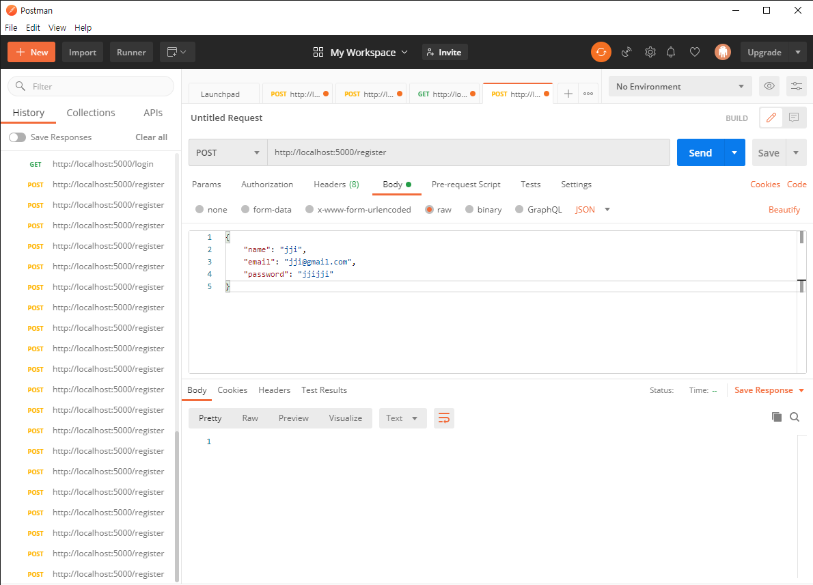
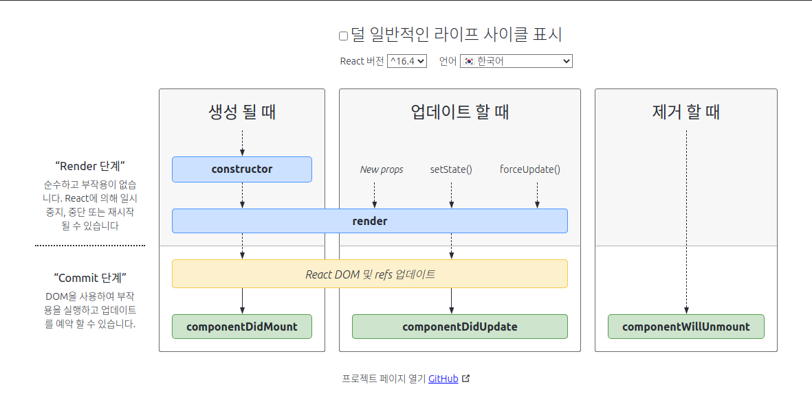
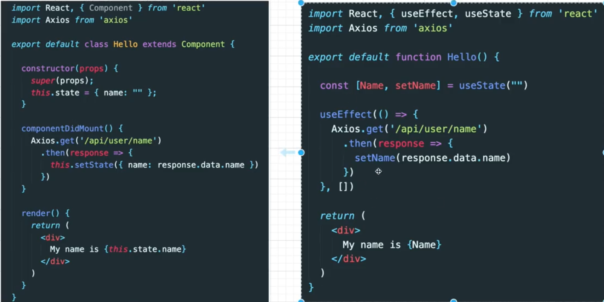

# boiler-plate

참고 : [강사님 소스](https://github.com/jaewonhimnae/boiler-plate-ko)

## 2강 Node JS, Express 다운로드 하기

vscode 설치

node js 설치

express 설치

```s님
npm install express --save
```

[hello world example](http://expressjs.com/en/starter/hello-world.html)

port번호만 5000으로 바꾸자

```js
const express = require("express");
const app = express();
const port = 5000;

app.get("/", (req, res) => {
  res.send("Hello World!");
});

app.listen(port, () => {
  console.log(`Example app listening at http://localhost:${port}`);
});
```

## 3강 몽고 DB 연결

1. [몽고DB](https://www.mongodb.com/cloud/atlas/lp/try2?utm_source=google&utm_campaign=gs_apac_south_korea_search_brand_atlas_desktop&utm_term=mongodb%20atlas&utm_medium=cpc_paid_search&utm_ad=e&utm_ad_campaign_id=1718986522&gclid=CjwKCAiAr6-ABhAfEiwADO4sfUJ19d-bNccf3BWka6XBTO6ZBQ3-iGbtOQoI8k4yvqlc2FxNZXzLDxoCcucQAvD_BwE) 회원 가입
2. Cluster 만들기 (시간이 좀 걸림)
3. 유저 생성
   - connect 버튼을 눌러라
   - Whitelist your connection IP address 에서 IP설정
   - Username, Password 입력 후 유저 생성 버튼 클릭
   - Choose a connection method 버튼 클릭, 다음 Connect your Application 선택, 접속 주소 복사
4. mongoose 설치

```sh
npm install mongoose --save
```

5. mongodb 연결

```js
const express = require("express");
const app = express();
const port = 5000;

const mongoose = require("mongoose");
mongoose
  .connect(
    "mongodb+srv://<user>:<password>@boiler.dwcw2.mongodb.net/test?retryWrites=true&w=majority",
    {
      useNewUrlParser: true,
      useUnifiedTopology: true,
      useCreateIndex: true,
      useFindAndModify: false,
    }
  )
  .then(() => console.log("MongoDB Connected..."))
  .catch((err) => console.log(err));

app.get("/", (req, res) => res.send("hello world"));

app.listen(port, () => console.log(`Exapmle app listening on port ${port}!`));
```

## 4강 MongoDB Model & Schema

### 모델이란?

스키마를 감싸주는 역할

### 스키마 [[참고]](https://nicewoong.github.io/development/2018/02/10/mongodb-feature/)

1. 스키마란?
   - 데이터베이스를 구성하는 개체(Entity), 속성(Attribute), 관계(Relationship) 및 데이터 조작 시에 데이터 값들이 갖는 제약조건 등에 관해 전반적으로 정의하는 것이다.
   - Schema가 존재한다는 것은 그 구조가 미리 정의되어 있어야 한다는 의미. 이는 데이터의 급격한 변화에 대응하기 힘듬.
2. MongoDB 는 이러한 스키마가 사전에 정의되지 않아도 된다.
3. 데이터베이스에 저장된 Document는 각기 다른, 다양한 필드를 가질 수 있다.
4. 각 필드는 서로 다른 데이터타입을 가질 수 있다.
5. 실제로 동적 형식의 스키마를 의미합니다.
6. 구조화 되지 않은 데이터를 쉽게 저장할 수 있음

### `mongoose.Schema` [[참고]](https://www.zerocho.com/category/MongoDB/post/59a1870210b942001853e250)

nosql의 고질적인 문제가 데이터의 스키마가 없어도 되기 때문에 에러가 안나서 편리한것 같지만 실제 사용 시 오타나 기타 이유로 발생하는 오류를 찾아 내기 힘들다.

위의 문제를 방지하기 위해 몽구스에서는
작성된 스키마 기준으로 데이터 검증을 하여 RDBMS와 비슷한 효과를 얻을 수 있다.

아래의 기능이 있다.

- 스키마에 어긋나는 데이터에 대해 에러 발생
- 스키마를 설정할 때 인덱스가지 걸수 있음
- 기본값 지정 가능
- virtual 필드
- 스키마나 다큐먼트에 사용자 정의 메소드 붙임
- 모델이나 쿼리에 직접 static method를 붙일 수 있음

### 모델 메소드

#### find, findOne, findById

#### findOneAndRemove, findOneAndUpdate, findByIdAndRemove, findByIdAndUpdate

### UserSchema (User.js)

```JS
const mongoose = require("mongoose");

const userSchema = mongoose.Schema({
  name: {type: String,maxLength: 50,},
  email: {type: String,trim: true,unique: 1,},
  password: {type: String,minLength: 1,},
  lastName: {type: String,maxLength: 50,},
  role: {type: Number,default: 0,},
  image: String,
  token: {type: String,},
  tokenExp: {type: Number,},
});

const User = mongoose.model("User", userSchema);

module.exports = { User };
```

## 5강 Git설치

## 6강

## 7강

### body-Parser

request 데이터의 body를 parsing

설치

```sh
npm install body-parser --save
```

index.js에 body-parser를 이용하여 회원가입 코딩

```js
const bodyParser = require("body-parser");

// application/x-www-form-urlencoded
app.use(bodyParser.urlencoded({ extended: true }));

//application/json
app.use(bodyParser.json());


...


...

app.post("/api/users/register", (req, res) => {
  // 회원 가입 할 때 필요한 정보들을 client에서 가져오면 그것들을 데이터베이스에 넣어준다.
  const user = new User(req.body);
  console.log(req.body);
  // return;
  user.save((err, userInfo) => {
    if (err) {
      console.log(err);
      return res.json({ success: false, err });
    }
    return res.status(200).json({ success: true });
  });
});
```

### postman [[다운로드]](https://www.postman.com/downloads/)

회원가입전송



## 8강 Nodemon 설치

```sh
npm install nodemon --save-dev
```

## 9강 비밀 설정 정보 관련관리

1. config 폴더생성
2. dev.js, prod.js, key.js 생성
3. dev.js에는 몽고디비 연결 주소를 넣고, prod.js에는 아래처럼 기록
   --> 이유는 로컬 실행환경과 배포이후의 실행환경을 분리함.

```js
module.exports = {
  mongoURI: process.env.MONGO_URI,
};
```

> 배포이후는 [heroku](https://www.heroku.com/home) 사이트에서 관리 하도록 만듦 4. key.js 코딩

```js
if (process.env.NODE_ENV === "production") {
  module.exports = require("./prod");
} else {
  module.exports = require("./dev");
}
```

5. index.js config.mongoURI 부분 수정

```js
mongoose
  .connect(config.mongoURI, {
    useNewUrlParser: true,
    useUnifiedTopology: true,
    useCreateIndex: true,
    useFindAndModify: false,
  })
  .then(() => console.log("MongoDB Connected..."))
  .catch((err) => console.log(err));
```

6. .gitignore에 dev.js를 등록하여 github에 올라가지 않도록 조치

## 10강 Bcrypt로 비밀번호 암호화 하기

[bcrypt](https://github.com/kelektiv/node.bcrypt.js#readme) 설치

```sh
npm install bcrypt --save
```

아래와 같이 코딩

```js
useSchema.pre("save", function (next) {
  // 여기에 처리할 내용을 코딩
  다;
  next();
});
```

위 코드는 mongodb에 저장하기 전에 전처리, 다 끝나면 next() 실행(여기서는 `index.js`의 `user.save()`)한다.(일종의 AOP??, 프록시 패턴??)

최종 코드

```js
const bcrypt = require("bcrypt");
const saltRounds = 10;

...

userSchema.pre("save", function (next) {
  // this는 userSchema를 가르킨다.
  let user = this;

  if (user.isModified("password")) {
    // 비밀 번호를 바꿀때만 암호화한다.
    bcrypt.genSalt(saltRounds, function (err, salt) {
      if (err) return next(err);

      bcrypt.hash(user.password, salt, function (err, hash) {
        if (err) return next(err);
        user.password = hash;
        next();
      });
    });
  } else {
    next();
  }
});

```

## 11강, 12강 로그인 기능 with Bcrypt, jsonwebtoken

기능 정리

1. 데이터베이스에서 요청한 e-mail 찾기
2. e-mail이 있으면 비밀번호가 같은지 확인
3. 비밀번호가 같은면 토큰 생성

### [jsonwebtoken](https://github.com/auth0/node-jsonwebtoken#readme) 설치

```sh
npm install jsonwebtoken --save
```

### [cookie-parser](https://github.com/expressjs/cookie-parser) 설치

```sh
npm isntall cookie-parser --save
```

### 최종 코드

index.js

```js
const cookieParser = require("cookie-parser");

...

app.use(cookieParser());

...

app.post("/api/users/login", (req, res) => {
  // 요쳥된 email을 데이터베이스에서 찾는다.
  User.findOne({ email: req.body.email }, (err, user) => {
    if (!user) {
      return res.json({
        loginSucess: false,
        message: "해당유저가 없습니다.",
      });
    }

    // 비밀번호가 같은지 확인한다.
    user.comparePassword(req.body.password, (err, isMatch) => {
      if (!isMatch) {
        return res.json({
          loginSucess: false,
          message: "비밀번호가 틀렸습니다.",
        });
      }

      // 비밀번호가 맞으면 토큰을 생성한다.
      user.generateToken((err, user) => {
        if (err) return res.status(400).send(err);

        // 토큰을 저장한다. where?? 쿠키, 로컬 스토리지, 세션
        // 여기서는 쿠키에 저장한다. cookieParser
        res
          .cookie("x_auth", user.token)
          .status(200)
          .json({ loginSucess: true, userId: user._id });
      });
    });
  });
});
```

User.js

```js
const jwt = require("jsonwebtoken");

...


userSchema.methods.comparePassword = function (plainPassword, callback) {
  // plainPassword 를 암호화된 비밀 번호와 비교한다.
  bcrypt.compare(plainPassword, this.password, function (err, isMatch) {
    if (err) return callback(err);
    callback(null, isMatch);
  });
};

userSchema.methods.generateToken = function (callback) {
  let user = this;
  // jsonwebtoken을 사용해서 토큰 생성
  let token = jwt.sign(user._id.toHexString(), "secretToken"); // user._id + 'secretToken' ==> token
  user.token = token;
  user.save(function (err, user) {
    if (err) return callback(err);
    callback(null, user);
  });
};
```


## 13강 Auth 기능 만들기

### 왜 필요한가?
> 1. 페이지 이동 때마다 로그인 되어 있는지, 관리자 유저인지 체크
> 2. 행위가 있을때 권한이 있는지 체크

### 처리방법
클라이언트(쿠키)와 서버(mongodb 유저 DB)의 토큰을 서로 비교한다.
1. 클라이언트 쿠키의 토큰 
2. JWT로 토큰 디코드 (결과 user id가 나옴) 
3. user id로 서버(mongodb) 서버 검색하여 토큰이 있는지, 같은지 확인
4. 확인 결과에 따른 처리

### 인증처리
라우터의 주소 변경(Router로 여러 단위로 나누어 관리 효율을 높임)
> /api/users/login, /api/users/register 

middleware/auth.js 생성

인증 처리를 위하여 아래와 같이 소스를 작성한다.
```js
const { User } = require("../models/User");

let auth = (req, res, next) => {
  // 인증 처리
  // 클라이언트 쿠키에서 토큰을 가져온다.
  let token = req.cookies.x_auth;

  // 토큰을 복호화 한 후 유저를 찾는다.
  User.findByToken(token, (err, user) => {
    // 유저가 있으면 인증 OK
    // 없으면 인증 NOK
    if (err) throw err;
    if (!user) return res.json({ isAuth: false, error: true });

    // 다음 실행될 콜백 함수에서 사용될 request 정보 편집
    req.token = token;
    req.user = user;

    next();
  });
};

module.exports = { auth };
```
Users.js
```js
...
userSchema.statics.findByToken = function (token, callback) {
  let user = this;
  // 토큰을 decode 한도
  jwt.verify(token, "secretToken", function (err, decoded) {
    // 유저 아이디를 이용해서 유저를 찾은 다음에
    // 클라이언트에서 가져온 token과 DB에 보관된 토큰이 일치하는지 확인

    user.findOne({ _id: decoded, token: token }, function (err, user) {
      if (err) return callback(err);
      callback(null, user);
    });
  });
};
```

index.js
```js
const { auth } = require("./middleware/auth");

...

// auth를 먼저 실행하고 콜백을 실행한다.
app.get("/api/users/auth", auth, (req, res) => {
  // 여기까지 미들웨어를 통과해 왔다는 것은 authentication이 true
  res.status(200).json({
    _id: req.user._id,
    isAdmin: req.user.role === 0 ? false : true,
    isAuth: ture,
    email: req.user.email,
    name: req.user.name,
    lastName: req.user.lastName,
    role: req.user.role,
    image: req.user.image,
  });
});

```
## 14 로그아웃 기능
1. 로그아웃 유저를 데이터베이스에서 찾음
2. 해당 유저의 토큰을 지움

index.js
```js
app.get("/api/users/logout", auth, (req, res) => {
  // 토큰을 지워준다.
  User.findOneAndUpdate({ _id: req.user }, { token: "" }, (err, user) => {
    if (err) return res.json({ success: false, err });
    return res.status(200).send({ success: true });
  });
});
```

## 15 리액트란
1. 리액트는 facebook에서 만든 라이브러리이다.
2. 컴퍼넌트로 되어 있어서 재사용성이 좋다.
3. Virtual DOM(Real DOM을 가볍게 복사)
    - 데이터가 바뀌면 바뀐부분만 랜더링한다.

## 16 Create-React-App
1. Babel : 최신 자바 스크립트 문법을 구형 브라우저에서 실행 가능하게 변환 시켜줌
2. Webpack : 여러 모듈을 번들하여 배포판을 만든다.
    * `src 디렉토리만 웹팩으로 관리한다. public 폴더는 제외됨`


### 폴더 정리
1. server, client 폴더 생성
2. 지금까지 한 내용을 server 폴더로 이동


### Create-React-App

client 디렉토리에서 create-react-app 실행

```sh
npx create-react-app .
```
실행 실패 시 c컴파일러 설정이 필요함


## 17 npm, npx
* npm : 디펜던시 관리 (-g 옵션은 프로젝트 디렉토리가 아닌 컴퓨터에 다운로드)
* npx : npm global 옵션 설치 없이 1회용으로 최신 버전을 사용할 수 있다.

## 18 구조설명
...

## 19 CRA to Our Boilerplate

###  구조설명
* _action, _reducer : Redux를 위한 폴더
* components/views : page
* components/views/Sections : 해당 페이지 관련된 css, component
* App.js : Routing
* Config : 환경 변수
* hoc(Higher Order Component) : 다른 컴포넌트를 가지고 있는 Function
* utils : 공통으로 사용되는 모듈

해당 구조로 디렉토리 생성하고 view의 각 페이지 생성 (rfce사용 ; ES7 extension)

## 20강 React Router Dom

[react-router](https://reactrouter.com/web/guides/quick-start) 참고

[basic](https://reactrouter.com/web/example/basic) 참고

설치
```bash
npm install react-router-dom --save
```

```jsx
<Route exact path="/">
  <LandingPage />
</Route>
```

위 처럼 쓴 것을 아래처럼 바꿀 수 있다.

```jsx
<Route exact path="/" component={LandingPage} />
```

### app.use, 미들웨어

- [app.use](https://github.com/xzcv1994/My-Study/issues/15)
- 미들웨어 [[1]](https://psyhm.tistory.com/8), [[2]](https://jinbroing.tistory.com/126)

각 페이지 생성하자.

## 21강 데이터 Flow & Axios

### AXIOS

- React JS에서 Request를 보내는데 그때 AXIOS를 사용 할것
- jQuery를 사용할때 AJAX

설치

```sh
npm install axios --save
```

### 참고
[useEffect](https://ko.reactjs.org/docs/hooks-effect.html)


## 22강 CORS 이슈, Proxy설정

### Cors(Cross-Origin Resource Sharing)가 무엇인가?

보안을 위해 각각 다른 서버(Origin)간 아무 설정 없이 Request를 보낼 수 없다.

[](https://developer.mozilla.org/ko/docs/Web/HTTP/CORS)
**잘안보이면 그림 클릭**

### Cors를 해결방안

client에 proxy를 설치 한다. [[참고]](https://create-react-app.dev/docs/proxying-api-requests-in-development/)

```sh
npm install http-proxy-middleware --save
```

`src/setupProxy.js` 파일 생성 후 아래 처럼 기입

```js
const { createProxyMiddleware } = require('http-proxy-middleware');

module.exports = function(app) {
  app.use(
    '/api',
    createProxyMiddleware({
      target: 'http://localhost:5000',
      changeOrigin: true,
    })
  );
```
## 23강 Proxy server

## 24강Concurrently 

### Concurrently 설치

서버와 클라이언트를 동시에 실행하기 위한 모듈

```sh
npm install concurrently --save
```

root의 package.json 파일에서 스크립트 부분 편집

```json

  "scripts": {
    "start": "node index.js",
    "backend": "nodemon server/index.js",
    "test": "echo \"Error: no test specified\" && exit 1",
    "dev": "concurrently \"npm run backend\" \"npm run start --prefix client\""
  },
```

이제 루트에서 `npm run dev` 만 실행하면 서버, 클라이언트 모두 실행 된다.

## 25강 Antd CSS Framwork

React JS를 위한 CSS Framework 종류

- Meterial UI
- React Bootstrap
- Semantic UI
- [`Ant Design`](https://ant.design/docs/react/introduce)
- Materialize
- ...

여기서는 And Design을 사용함

설치방법 :

```sh
npm install antd --save

```

## 26강 Redux 기초

### `props`

- 부모 컴포넌트에서 자식컴포넌트로 데이터를 주고 받을때 사용
- 자식 컴포넌트에서는 수정 불가(immutable), 수정을 위해서는 부모에서 수정해서 자식으로 전달 해야 함

### `state`

- 컴포넌트 안에서 사용하는 변수(mutable)
- 변경하면 rerandering 가능 하다.

### [redux](https://www.youtube.com/watch?v=dJC_uAR7d60&list=PL9a7QRYt5fqkZC9jc7jntD1WuAogjo_9T&index=26)

state를 체계적으로 관리하는 도구

[](https://www.tutorialandexample.com/react-redux/)

Redux가 없을 경우는 state 변경을 위해 복잡한 데이터 전달 과정이 필요하지만, Redux가 있으면 Store에 의해 간단하게 처리 된다.
한 방향으로만 데이터가 흐른다.

[](https://medium.com/@ca3rot/%EC%95%84%EB%A7%88-%EC%9D%B4%EA%B2%8C-%EC%A0%9C%EC%9D%BC-%EC%9D%B4%ED%95%B4%ED%95%98%EA%B8%B0-%EC%89%AC%EC%9A%B8%EA%B1%B8%EC%9A%94-react-redux-%ED%94%8C%EB%A1%9C%EC%9A%B0%EC%9D%98-%EC%9D%B4%ED%95%B4-1585e911a0a6)

#### 구조 (참고 : [[1]](https://medium.com/@ca3rot/%EC%95%84%EB%A7%88-%EC%9D%B4%EA%B2%8C-%EC%A0%9C%EC%9D%BC-%EC%9D%B4%ED%95%B4%ED%95%98%EA%B8%B0-%EC%89%AC%EC%9A%B8%EA%B1%B8%EC%9A%94-react-redux-%ED%94%8C%EB%A1%9C%EC%9A%B0%EC%9D%98-%EC%9D%B4%ED%95%B4-1585e911a0a6))

- `Action` : 어떤 일이 있어났는지 설명하는 객체

- `Reducer` : state변경이 어떻게 일어났는지 설명하는 함수, 이전 State와 Action Object를 리턴한다.

- `Store`
  - state는 기본적으로 여기서 집중 관리됨
  - 커다란 JSON으로 생각하면 됨
  - 규모가 클 경우 카테고리로 나누어 분류 하는 것이 일반적

```js
{
    // 세션과 관련된 것
    session: {
        loggedIn: true,
        user: {
            id: "114514",
            screenName: "@mpyw",
        },
    },
​
    // 표시중인 타임라인에 관련된 것
    timeline: {
        type: "home",
        statuses: [
            {id: 1, screenName: "@mpyw", text: "hello"},
            {id: 2, screenName: "@mpyw", text: "bye"},
        ],
    },
​
    // 알림과 관련된 것
    notification: [],
}
```

## 27강 Redux up

설치

```sh
npm install redux react-redux redux-promise redux-thunk --save
```

store에서 모든 state관리를 한다. 값을 변경하고자 할때는 Dispatch를 이용해서 Action으로 변경한다.

Action은 객체 형식이어야 한다. 그런데 promise, function을 받기 위해 `redux-promise`, `redux-thunk` 미들웨어를 사용한다.

> redux-thunk : 디스페치에게 어떻게 Function을 받는지 알려줌

> redux-promise : promise가 왔을때 어떻게 대처하는지 알려줌

### 코딩

 _reducers/index.js
```js
import { combineReducers } from 'redux';
import user from './user_reducer';

// 여러 reducer를 combineReducers를 통해 rootReducer로 합쳐주는 역할
const rootReducer = combineReducers({
    user
});

export default rootReducer;
```
_reducers/user_reducer.js
```js
import { LOGIN_USER, REGISTER_USER, AUTH_USER } from "../_actions/types";

const UserReducer = function (state = {}, action) {
  // 아래는 나중에 사용
  // switch (action.type) {
  //   case LOGIN_USER:
  //     return { ...state, loginSuccess: action.payload };
  //   case REGISTER_USER:
  //     return { ...state, register: action.payload };
  //   case AUTH_USER:
  //     return { ...state, userData: action.payload };
  //   default:
  //     return state;
  // }
};

export default UserReducer;

```


index.js
redux devtool 사용을 위해 플러그 인 도 입력


      window.__REDUX_DEVTOOLS_EXTENSION__ &&
      window.__REDUX_DEVTOOLS_EXTENSION__()

그 후 크롬 확장 프로그램에서 redux devtool 설치


   
```js
import React from "react";
import ReactDOM from "react-dom";
// import './index.css';
import App from "./App";
import * as serviceWorker from "./serviceWorker";
import { Provider } from "react-redux";
import "antd/dist/antd.css";
import { applyMiddleware, createStore } from "redux";
import promiseMiddleware from "redux-promise";
import ReduxThunk from "redux-thunk";
import Reducer from "./_reducers"; 

const createStoreWithMiddleware = applyMiddleware(
  promiseMiddleware,
  ReduxThunk
)(createStore);

ReactDOM.render(
  <Provider
    store={createStoreWithMiddleware(
      Reducer,
      window.__REDUX_DEVTOOLS_EXTENSION__ &&
        window.__REDUX_DEVTOOLS_EXTENSION__()
    )}
  >
    <App />
  </Provider>,
  document.getElementById("root")
);

// If you want your app to work offline and load faster, you can change
// unregister() to register() below. Note this comes with some pitfalls.
// Learn more about service workers: https://bit.ly/CRA-PWA
serviceWorker.unregister();

```

## 28강 [React Hooks](https://ko.reactjs.org/docs/hooks-overview.html)

|`Class Component`| `Functional Component`|
|:---|:---|
|기능이 많음|기능이 적음|
|코드가 김|코드가 짧음|
|복잡한 코드|심플한 코드|
|실행속도 빠름|실행 속도 느림|
|||

----
[](https://projects.wojtekmaj.pl/react-lifecycle-methods-diagram/)


> React 16.8 부터 Hook을 사용할 수 있게 됨

> class에서 제공하는 `componentDidMount`, `componentDidUpdate`, `componentWillUnmount의` 기능을 함수형 컴포넌트에서도 사용 가능해진다.

class와 hook을 사용한 function 비교



## 29, 30강 로그인 페이지 

Formik, Yup 라이브러리를 사용해서 다이나믹 기능을 넣으면 좋음

여기에는 빠져 있음, 나중에 업그레이드 해보자~

`_actions/users_acton.js` 생성 후 코딩

```js
// 최종본이 반영 되어 있음
// 여기서는 loginUser() 부분만 필요
import axios from "axios";
import { LOGIN_USER, REGISTER_USER, AUTH_USER } from "./types";
export function loginUser(dataToSubmit) {
  // 서버로 request를 날려서 받은 response에서 data를 가져와서 
  // request에 넣는다.
  const request = axios
    .post("/api/users/login", dataToSubmit)
    .then((response) => response.data);

  // Action은 type, reponse가 필요
  return {
    // LOGIN_USER를 위해 ./types를 정의
    type: LOGIN_USER,
    payload: request,
  };
}

export function registerUser(dataToSubmit) {
  const request = axios
    .post("/api/users/register", dataToSubmit)
    .then((response) => response.data);

  return {
    type: REGISTER_USER,
    payload: request,
  };
}

export function auth() {
  const request = axios
    .get("/api/users/auth")
    .then((response) => response.data);

  return {
    type: AUTH_USER,
    payload: request,
  };
}


```


_reducers/user_reducer.js
```js
// 최종본이 반영되어 있음
// 여기서는 LOGIN_USER만 반영
import { LOGIN_USER, REGISTER_USER, AUTH_USER } from "../_actions/types";

const UserReducer = function (state = {}, action) {
  switch (action.type) {
    case LOGIN_USER:
      // (previousState, action) => nextState
      // 이전 State와 action object를 받은 후 next state를 return 한다
      return { ...state, loginSuccess: action.payload };
    case REGISTER_USER:
      return { ...state, register: action.payload };
    case AUTH_USER:
      return { ...state, userData: action.payload };
    default:
      return state;
  }
};

export default UserReducer;

```

_actions/types.js
```js
// 최종본이 반영되어 있음
// 여기서는 LOGIN_USER만 반영
export const LOGIN_USER = "login_user";
export const REGISTER_USER = "register_user";
export const AUTH_USER = "auth_user";

```

LoginPage.js
```js

import React, { useState } from "react";
// import Axios from 'axios';
import { useDispatch } from "react-redux";
import { loginUser } from "../../../_actions/user_action";

function LoginPage(props) {
  const dispatch = useDispatch();
  const [Email, setEmail] = useState("");
  const [Password, setPassword] = useState("");

  // key 입력의 핸들러
  const onEmailHandler = (event) => {
    setEmail(event.currentTarget.value);
  };
  const onPasswordHandler = (event) => {
    setPassword(event.currentTarget.value);
  };

  const onSubmitHandler = (event) => {
    // 페이지가 리로딩 되는 것을 막음
    event.preventDefault();

    console.log(Email, Password);

    let body = {
      email: Email,
      password: Password,
    };

    // loginUser는 _actions/user_action.js 에 정의
    dispatch(loginUser(body)).then((response) => {
      if (response.payload.loginSucess) {
        props.history.push("/");
      } else {
        alert("Error");
      }
    });
  };

  return (
    <div
      style={{
        display: "flex",
        justifyContent: "center",
        alignItems: "center",
        width: "100%",
        height: "100vh",
      }}
    >
      <form
        style={{ display: "flex", flexDirection: "column" }}
        onSubmit={onSubmitHandler}
      >
        <label>Email</label>
        <input type="email" value={Email} onChange={onEmailHandler} />
        <label>Password</label>
        <input type="password" value={Password} onChange={onPasswordHandler} />

        <br />
        <button type="submit">Login</button>
      </form>
    </div>
  );
}

export default LoginPage;

```


## 31강 회원가입 페이지